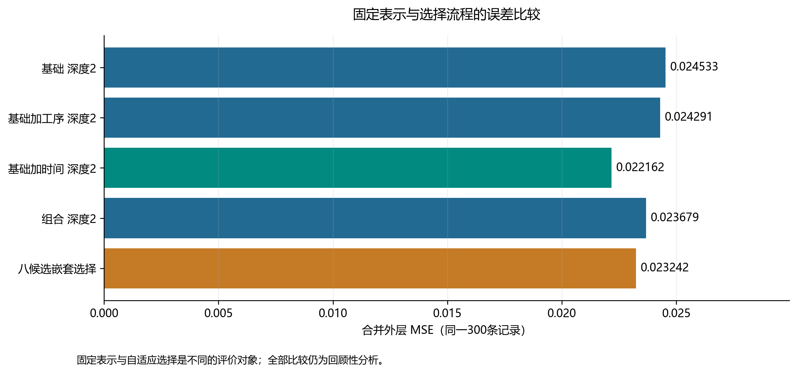
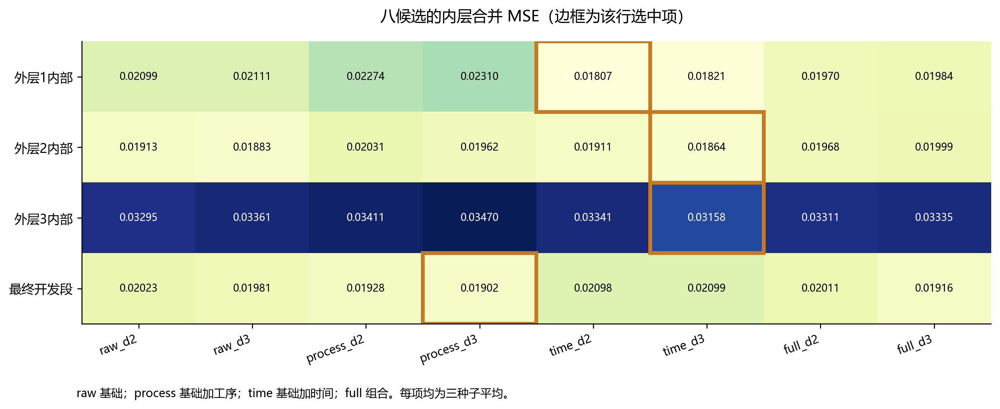
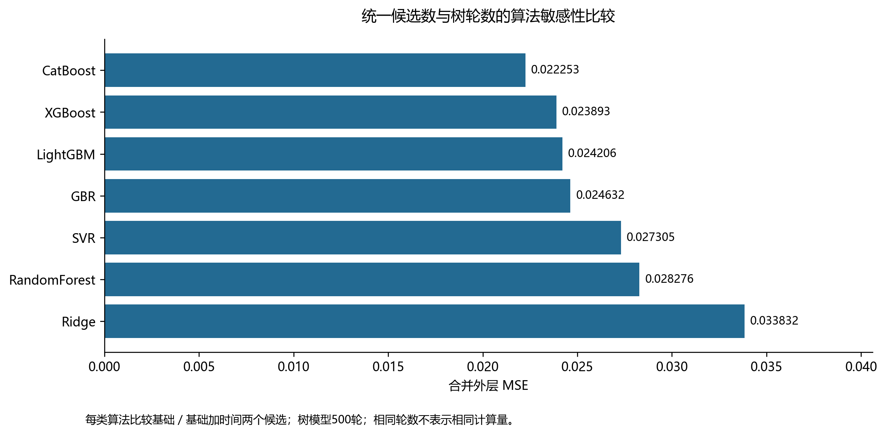
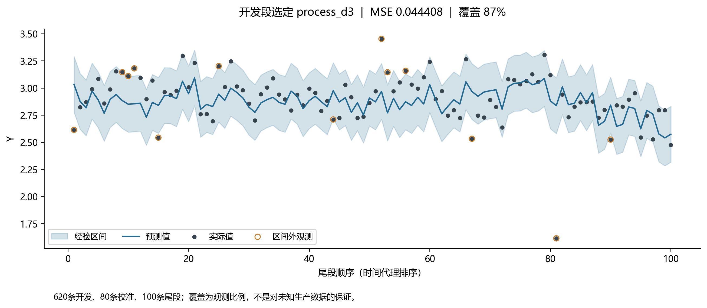
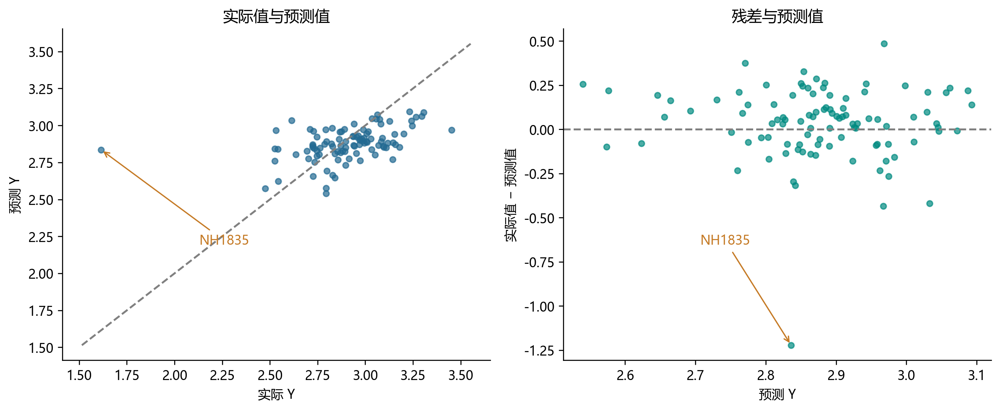
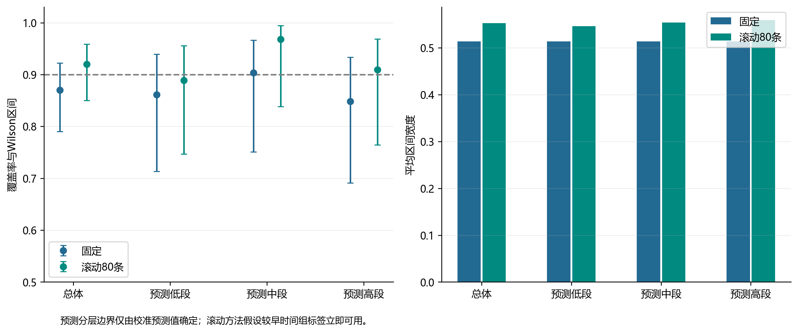

# TFT-LCD质量特性预测方法比较报告

本研究比较匿名完整记录上的特征分支、算法与配置选择策略。工序统计未获得稳定增量改善证据；时间分支在所列固定比较中更有预测信息，但全部5952项输入的目标测量前可用性均未核实。研究定位为离线回顾性质量特性估计。

## 特征与选择流程

表5-1 同一300条外层记录的特征与选择策略比较

| 方法 | MSE | RMSE | MAE | R² |
|---|---|---|---|---|
| 训练均值基线 | 0.040841 | 0.202091 | 0.156988 | -0.100409 |
| 基础特征 深度2 | 0.024533 | 0.156629 | 0.128971 | 0.338996 |
| 基础加工序统计 深度2 | 0.024291 | 0.155855 | 0.126989 | 0.345513 |
| 基础加时间特征 深度2 | 0.022162 | 0.148870 | 0.121086 | 0.402861 |
| 组合特征 深度2 | 0.023679 | 0.153881 | 0.125769 | 0.361983 |
| 四候选嵌套选择 | 0.025348 | 0.159211 | 0.130798 | 0.317019 |
| 八候选嵌套选择 | 0.023242 | 0.152455 | 0.124090 | 0.373755 |

四种深度2固定表示中，基础加时间特征的MSE最低，为0.022162。加入工序统计并未在此基础上继续降低误差，组合特征不能据名称视为更优方案。四候选与八候选选择流程的MSE分别为0.025348和0.023242；二者评价的是内层选择规则在外层的表现，不等同于某个固定配置的分数。

## 正式候选与开发段选择

表5-4 八候选搜索的窗口选择结果

| 开发范围 | 选中配置 | 内层合并MSE |
|---|---|---|
| 外层1内部 | time_d2 | 0.018069 |
| 外层2内部 | time_d3 | 0.018637 |
| 外层3内部 | time_d3 | 0.031577 |
| 最终开发段 | process_d3 | 0.019019 |

表5-4a 最终开发段全部候选的内层分数

| 候选配置 | 内层1 MSE | 内层2 MSE | 合并MSE |
|---|---|---|---|
| process_d3 | 0.025303 | 0.012735 | 0.019019 |
| full_d3 | 0.024943 | 0.013370 | 0.019157 |
| process_d2 | 0.024049 | 0.014516 | 0.019283 |
| raw_d3 | 0.025583 | 0.014046 | 0.019814 |
| full_d2 | 0.025510 | 0.014708 | 0.020109 |
| raw_d2 | 0.025336 | 0.015114 | 0.020225 |
| time_d2 | 0.027089 | 0.014879 | 0.020984 |
| time_d3 | 0.027376 | 0.014608 | 0.020992 |

三个外层的内层分别选择time_d2、time_d3、time_d3。最终开发段选择process_d3，即基础加工序统计 深度3，其内层合并MSE为0.019019。表5-4a同时展示全部八个候选，基础加时间的两个深度均实际参与比较。最终配置由开发段内层排名决定，固定外层最低分仅作为表示比较的结果，不用于再次覆盖选参决定。固定process_d3的外层MSE为0.025181，并非固定配置中最低。这种开发段与外层排名不一致体现了窗口依赖，不能由一次选中推断分支稳定有效。

所有八个候选均经历两个内层60条窗口和三个固定种子；切分与四候选对照逐索引一致。外层得分不用于覆盖开发段内层的选定配置。最终process_d3的内层MSE只比full_d3低约0.000137，三个外层却均选择时间分支，说明排名依赖窗口。

## 同样本算法与预算敏感性

组合特征下的多算法对照见 outputs/supplement/baseline_summary.csv。

表5-2a 统一候选数与树轮数的敏感性比较

| 算法 | MSE | MAE | 累计学习器秒数 |
|---|---|---|---|
| CatBoost | 0.022253 | 0.121043 | 47.4 |
| XGBoost | 0.023893 | 0.126715 | 12.1 |
| LightGBM | 0.024206 | 0.127611 | 4.5 |
| GBR | 0.024632 | 0.128963 | 82.9 |
| SVR | 0.027305 | 0.133309 | 0.5 |
| RandomForest | 0.028276 | 0.137015 | 48.8 |
| Ridge | 0.033832 | 0.146310 | 0.3 |

在两个特征候选及固定参数条件下，CatBoost的外层MSE最低，为0.022253。耗时累计该算法全部内层拟合与外层三成员拟合、预测，公共预处理耗时另存。测量来自本机运行，可能受并发负载影响，不能作为严格效率排名。该比较检验有限预算设置的敏感性，尚未覆盖CatBoost原生类别处理和表格基础模型，因此不作算法普遍优劣或前沿最佳性能的判断。

## 统计推断

表5-3a 配对关联组误差差异与多重比较

| 比较 参考减候选 | MSE差及95%区间 | 原始p | Holm p |
|---|---|---|---|
| 基础－基础加工序 | 0.000242 [-0.001149, 0.001554] | 0.733253 | 1.000000 |
| 基础－基础加时间 | 0.002370 [0.001010, 0.003772] | 0.000600 | 0.005999 |
| 基础－组合 | 0.000853 [-0.000628, 0.002348] | 0.268346 | 1.000000 |
| 组合－组合去缺失 | 0.000507 [0.000026, 0.001033] | 0.048390 | 0.338732 |
| 组合－中位数填充 | -0.000018 [-0.000706, 0.000693] | 0.958008 | 1.000000 |
| 组合－设备至少5个 | -3.07e-09 [-9.28e-09, 0.000000] | 1.000000 | 1.000000 |
| 组合－至少5个并收缩 | 0.000371 [-0.000192, 0.000951] | 0.195761 | 1.000000 |
| 组合－基础加时间 | 0.001517 [0.000421, 0.002683] | 0.012997 | 0.103979 |
| 组合－八候选选择 | 0.000437 [-0.000636, 0.001574] | 0.461308 | 1.000000 |
| 基础加时间－八候选选择 | -0.001080 [-0.001858, -0.000358] | 0.003599 | 0.032394 |
| 四候选选择－八候选选择 | 0.002106 [0.000912, 0.003316] | 0.000400 | 0.004399 |

基础减去基础加时间的MSE差为0.002370，相对基础MSE降低约9.66%；95%区间为[0.001010, 0.003772]，原始p为0.000600，在11项比较中Holm校正p为0.005999。

校正族共11项不同的特征与选择策略比较，排除了同一假设的重复实现。95%区间为个别区间；Holm校正不覆盖所有研究历史或算法搜索。已有预测上的关联组重采样仍不能消除适应性分析偏差。

## 时间方向与输入可用性

逐字段清点位于 ../availability/all_input_availability.csv，5952项均未核实早于Y测量可用。用户确认未收到字段字典或采集时点说明。72个时间字段的行中位数用于排序，时间分支另包含工序时间统计和路线代理差。删除显式时间输入也不能认证其他字段。

A有250/300、B有373/412条记录的代理早于训练范围下界，均无晚于训练范围上界的记录。全量训练拟合A/B属于跨时间范围离线估计；按代理顺向回放的外层结果不能代替实际生产前瞻评价。

## 最终配置的尾段与A/B输出

最终开发配置为process_d3。冻结尾段MSE 0.044408，MAE 0.149869，R² 0.170274；A回顾性MSE 0.032528。尾段及A误差并未因扩大候选而降低，不能把外层选择流程改善写成所有场景均改善。

表5-6 选定模型的固定与滚动校准

| 校准方式 | 覆盖记录 | 平均宽度 | Wilson区间 |
|---|---|---|---|
| 固定校准 | 87/100 | 0.514080 | [79.0%, 92.2%] |
| 滚动80条 | 92/100 | 0.552983 | [85.0%, 95.9%] |

滚动校准覆盖92/100条记录，平均宽度为0.552983。

尾段绝对残差最大的记录为NH1835，实际值为1.6142，预测值为2.8361，残差为-1.2219。该记录贡献33.6%的尾段总平方误差。

八候选选定模型在5条低值记录上的MSE为0.369539，低值召回率为0%。

选定的基础加工序统计 深度3三成员模型在本机的单记录预测中位耗时为3.812秒，100条批量预测为3.997秒，包含输入驻留内存时的特征转换与模型计算。测试不包含生产采集、网络、排队和质检反馈时间，不能据此承诺产线实时性。

submission_A.csv为800条训练标签拟合后的A点预测；submission_B_train_only.csv只用训练标签；submission_B.csv为合并公开A标签的研究场景。全部为两列无表头，ID和测试行序一致。B无真值，A标签使用条款未核实，未上传竞赛平台。

## 完整过程与复现

数据核验与关联组 → 字段可用性清点 → 折内处理 → 固定表示比较 → 八候选嵌套选择 → 开发段选定配置 → 冻结校准与尾段 → A/B重拟合 → 逐记录统计和作图。算法预算比较、低值诊断和敏感性是同一研究的独立比较环节。

数据与处理记录、强基线和消融保存在 ../supplement/；八候选协议、逐折分数、逐记录预测、模型和提交保存在本目录；预算实验保存在 ../fair_comparison/。全部实际数字由CSV/JSON生成。修改与舍弃原因另见 PROJECT_PROCESS.md，论文正文保持研究者叙述。

## 可视化

