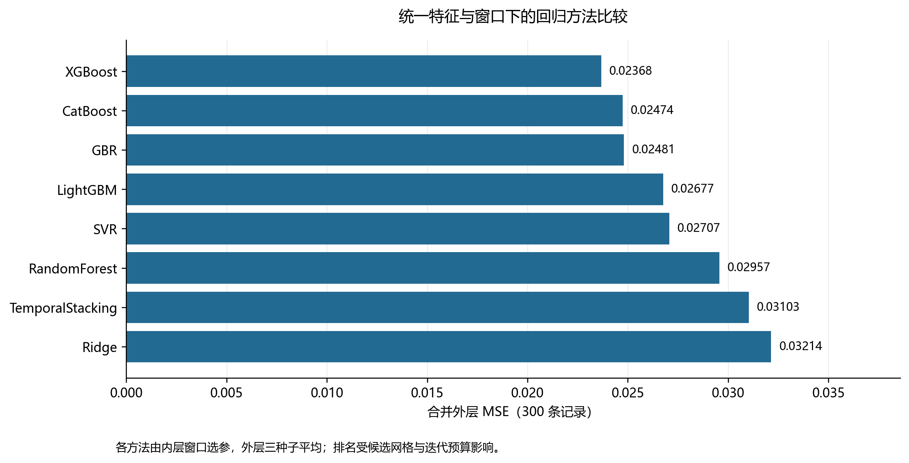
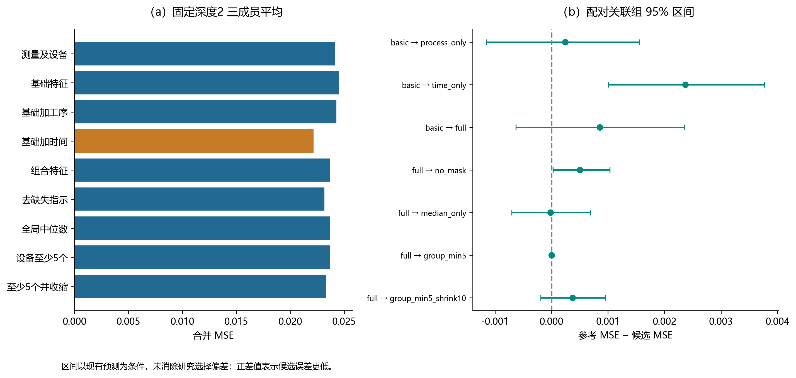
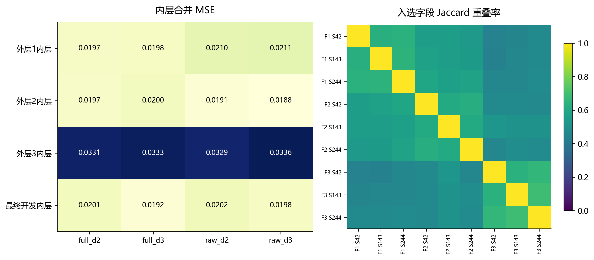
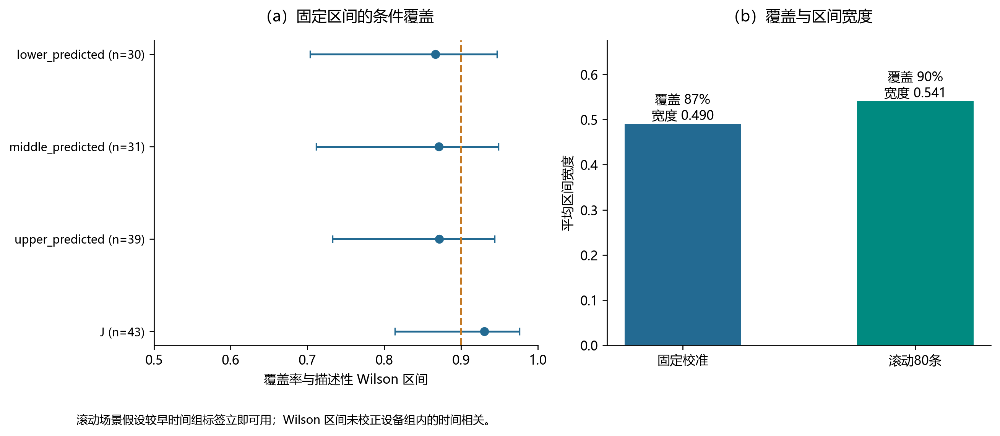

# TFT-LCD质量特性预测实验报告

研究对象为800条训练记录及A/B测试记录的连续Y回归。模型先在训练折拟合数据处理与工序特征，再进行嵌套窗口、固定对照、分支消融与误差诊断。所有主比较均保存逐记录结果。

## 主要证据

基础与完整特征的300条外层记录属于296个关联组。MSE差约0.000853，整组bootstrap区间[-0.000628,0.002348]，组级符号翻转p约0.2683；尚未获得稳定改善证据。时间特征单独加入时误差差异更明确，不能把完整特征的全部差异归功于工序聚合。

## 同样本算法比较

| 方法 | MSE | RMSE | MAE | R² |
|---|---|---|---|---|
| XGBoost | 0.023679 | 0.153881 | 0.125769 | 0.361983 |
| CatBoost | 0.024744 | 0.157301 | 0.128066 | 0.333306 |
| GBR | 0.024808 | 0.157507 | 0.128699 | 0.331563 |
| LightGBM | 0.026769 | 0.163612 | 0.131629 | 0.278738 |
| SVR | 0.027066 | 0.164516 | 0.131155 | 0.270744 |
| RandomForest | 0.029567 | 0.171951 | 0.140418 | 0.203347 |
| TemporalStacking | 0.031028 | 0.176148 | 0.137225 | 0.163983 |
| Ridge | 0.032143 | 0.179285 | 0.144001 | 0.133935 |

算法由内层有限网格选参、外层三种子平均。各算法预算明示但不完全相等；Stacking为统一时间OOF协议下的适配对照。

## 特征与填充消融

| 配置 | MSE | MAE |
|---|---|---|
| basic | 0.024533 | 0.128971 |
| full | 0.023679 | 0.125769 |
| group_min5 | 0.023679 | 0.125769 |
| group_min5_shrink10 | 0.023309 | 0.124223 |
| measurements | 0.024149 | 0.127537 |
| median_only | 0.023697 | 0.125930 |
| no_mask | 0.023173 | 0.123756 |
| process_only | 0.024291 | 0.126989 |
| time_only | 0.022162 | 0.121086 |

## 单因素敏感性

| 配置 | MSE | MAE |
|---|---|---|
| drift_0 | 0.024721 | 0.128059 |
| drift_0.5 | 0.023860 | 0.125883 |
| importance_0.5 | 0.023517 | 0.124909 |
| importance_0.9 | 0.023336 | 0.123191 |
| lr0.025 | 0.025507 | 0.129855 |
| mask0 | 0.023729 | 0.123646 |
| mask0.02 | 0.024906 | 0.128065 |
| reference_seed42 | 0.024816 | 0.127903 |
| reg0.1_10 | 0.025050 | 0.127435 |
| reg0_1 | 0.023154 | 0.123125 |
| rounds600 | 0.025185 | 0.129127 |
| top160 | 0.024087 | 0.126704 |
| top640 | 0.024146 | 0.125450 |

敏感性固定种子42，不与三成员结果混算改进率。

## 区间与尾段

| 策略 | 记录数 | 覆盖率 | 平均宽度 |
|---|---|---|---|
| fixed | 100 | 0.870000 | 0.490183 |
| rolling80_immediate_labels | 100 | 0.900000 | 0.540555 |

滚动校准假设较早时间组标签立即可用；其覆盖提升伴随宽度增加，不代表现场时延条件已成立。NH1835贡献约36.1%的尾段总平方误差，绝对损失与低值加权未消除该误差。

## 使用与复现

训练集、A、B两两无相同ID或完全相同输入。A回顾性MSE为0.031630；B无标签。A标签训练B的具体竞赛条款尚未核实，合并标签模型按研究场景解释，另保留训练标签B预测。

运行python -m innovative_solution.run生成主要模型，运行python -m innovative_solution.run_supplement完成有限补充比较。第三方数据权限、完整复现步骤及环境见REPRODUCE.md。

论文正文与实验结果是同一项研究；意见处理和15项答辩回答单独保存于review/审稿意见处理与答辩回答.md。

## 图表

