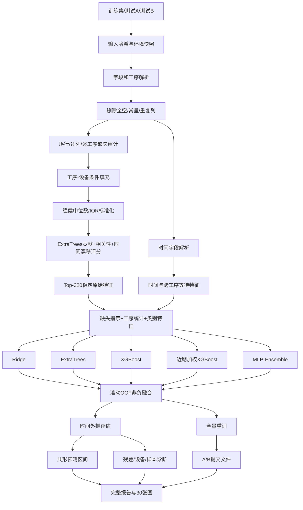

# 产品特性预测项目完整流程与决策记录

## 1. 项目目标

项目面向TFT-LCD多工序生产过程，根据机台、工艺参数、时间字段和设备路线预测连续产品特性值`Y`。技术目标包括：

1. 在小样本、高维、缺失和异常并存的条件下获得稳定回归结果；
2. 用时间外推验证生产批次变化下的泛化能力；
3. 输出关键工序、稳定特征、异常样本和预测区间；
4. 保存数据、配置、指标、图表和运行耗时，使实验可追溯、可复现。

## 2. 数据口径

| 数据 | 样本数 | 字段数 | 用途 |
|---|---:|---:|---|
| 训练集 | 800 | 5954 | 模型开发、时间验证和最终训练 |
| 测试集A | 300 | 5953 | 最终预测 |
| 测试集B | 412 | 5953 | 最终预测 |

结构审计结果：

- 删除全空特征227列；
- 删除常量特征717列；
- 删除完全重复特征2305列；
- 识别并重构时间字段72列；
- 保留可建模数值特征2617列、类别字段14列；
- 最终工程特征802维；
- 609条训练样本至少存在一个缺失值，单样本最高缺失率13.1%。

## 3. 最终流程



## 4. 分阶段处理

### 阶段一：输入与可复现快照

处理内容：

- 读取训练、测试A和测试B；
- 缓存Excel解析结果，加速重复实验；
- 记录原始文件SHA256、文件大小、Python版本、依赖版本、随机种子和完整配置。

输出：

- `reproducibility_snapshot.json`
- `run_manifest.json`
- `.cache/*.pkl`

### 阶段二：结构清洗与工序识别

处理顺序：

1. 识别ID、目标值、数值字段和类别字段；
2. 根据`210X1、311X32、440AX1`等命名提取工序编号；
3. 根据字段在原表中的位置，将工序关联到最近的前置`Tool/TOOL_ID/Chamber`字段；
4. 删除全空、常量和完全重复字段；
5. 将每列处理状态、缺失率、零值率、唯一值数和时间格式比例写入审计表。

输出：

- `feature_audit.csv`
- `operation_audit.csv`
- `plots/01_data_audit_by_operation.png`

### 阶段三：缺失值处理

处理顺序：

1. 统计每一列缺失率；
2. 统计每一行缺失数量、缺失率、完全缺失工序和部分缺失工序；
3. 生成800×15的样本-工序缺失率矩阵；
4. 分析各工序缺失率是否随设备类别变化；
5. 在每个训练折内按“工序对应设备组均值”填充；
6. 未覆盖值使用该训练折全局中位数兜底；
7. 对缺失率达到阈值的入选特征增加缺失指示。

缺失机制只标记为统计候选，不能脱离设备停机、未经过工序或采集故障日志直接认定为物理原因。

输出：

- `row_missing_report.csv`
- `row_operation_missing_matrix.csv`
- `missing_mechanism_report.csv`
- `plots/17_row_and_column_missingness.png`
- `plots/18_sample_operation_missing_heatmap.png`

### 阶段四：时间字段重构

处理顺序：

1. 检测8位、14位和16位生产时间字段；
2. 转换为统一秒时间；
3. 按训练折最早时间生成相对天数；
4. 生成每道工序开始、结束、中位时间、时间跨度和有效时间比例；
5. 按工序顺序生成相邻工序等待时间和重叠标志。

时间列不直接删除，也不把匿名字段排列误当作连续传感器序列。

### 阶段五：特征工程

最终特征由五类视图组成：

| 特征视图 | 内容 | 量纲处理 |
|---|---|---|
| 稳定原始特征 | Top-320原始过程变量 | 树模型保留原量纲 |
| 缺失特征 | 入选变量的缺失指示 | 0/1 |
| 工序统计 | 均值、标准差、分位数、极差、异常率、缺失率、零值率 | 先用训练折中位数/IQR转为稳健Z分数 |
| 时间特征 | 工序起止、跨度、等待和重叠 | 天、分钟、小时或0/1 |
| 类别特征 | Tool、Chamber和Operation的One-Hot | 0/1 |

稳定特征评分联合：

- ExtraTrees预测贡献；
- 与目标值的绝对相关性；
- 开发期前后段的稳健中位数漂移。

输出：

- `feature_selection_stability.csv`
- `feature_variance_report.csv`
- `feature_semantics.csv`
- `plots/10_feature_selection_stability.png`
- `plots/19_variance_importance_drift.png`

### 阶段六：分布、变换和降维实验

分布分析：

- 对12个稳定重要特征拟合Normal、Laplace、Logistic和Student-t；
- 使用AIC选择相对最优分布，使用KS检验判断一致性；
- 0个AIC最优分布通过5%水平KS检验，因此不采用统一正态假设。

特征变换实验：

- 原始值；
- StandardScaler；
- RobustScaler；
- Quantile-to-Normal；
- Yeo-Johnson。

可插拔降维接口：

- `none`；
- `pca50`；
- `pca95`；
- `svd50`；
- `pls20`；
- `autoencoder16`。

在统一Ridge滚动实验中，PCA50最低，MSE为0.038703，但仍弱于树模型主干。因此PCA保留为线性对照，不进入最终融合。`autoencoder16`已实现接口，但没有作为默认实验结果参与结论。

输出：

- `theoretical_distribution_fit.csv`
- `transform_reducer_folds.csv`
- `transform_reducer_summary.csv`
- `plots/20_theoretical_distribution_fit.png`
- `plots/21_transform_reducer_comparison.png`
- `plots/22_reducer_dimension_and_error.png`

### 阶段七：验证与参数搜索

采用三层验证：

1. 随机五折CV：衡量同分布拟合精度；
2. 四折滚动时间CV：仅用过去批次预测未来批次，用于融合权重和区间校准；
3. 时间外推评估：保留最后160条生产顺序样本，衡量批次泛化。

嵌套网格搜索：

- 外层使用滚动时间折；
- 内层使用三折KFold；
- 搜索`n_estimators={800,1200}`、`max_depth={2,3}`、`min_child_weight={1,3}`；
- 结果支持`n_estimators=1200`、`max_depth=2`，多数外层折选择`min_child_weight=3`。

输出：

- `fold_metrics.csv`
- `nested_grid_search_outer.csv`
- `nested_grid_search_candidates.csv`
- `plots/03_cv_model_stability.png`
- `plots/04_oof_vs_temporal_holdout.png`
- `plots/24_nested_grid_search.png`

### 阶段八：候选模型与融合

候选模型：

- Dummy均值基线；
- Ridge；
- RandomForest；
- ExtraTrees；
- XGBoost；
- 近期样本加权XGBoost；
- 三成员MLP-Ensemble。

最终融合权重只通过滚动时间OOF求解，约束权重非负且总和为1：

| 模型 | 最终权重 | 处理状态 |
|---|---:|---|
| XGBoost | 60.6% | 保留 |
| 近期加权XGBoost | 33.9% | 保留 |
| ExtraTrees | 5.5% | 保留 |
| Ridge | 0% | 从最终融合中舍弃 |
| MLP-Ensemble | 0% | 从最终融合中舍弃 |

RandomForest只作为标准树模型对照；其滚动MSE为0.030048，高于XGBoost的0.028343，因此不进入最终融合。

### 阶段九：残差、样本和可信度

分析内容：

- 真实值与预测值；
- 残差直方图和残差-预测图；
- 分设备MSE、MAE和样本数；
- 高误差样本累计MSE贡献；
- Top-20高误差样本的局部特征稳健Z分数；
- Shapiro-Wilk和D'Agostino正态性检验；
- Breusch-Pagan异方差检验；
- Ljung-Box残差自相关检验；
- 90%共形预测区间。

当前残差显著偏离正态，并在滞后5和10阶存在生产顺序自相关；未发现显著Breusch-Pagan异方差。90%共形区间在时间外推集上的实际覆盖率为90.0%。

样本`NH1835`保持在评价集中并单独诊断，不在缺少采集错误证据时通过删除样本提高分数。

### 阶段十：无测试标签的全量基线

使用全部800条训练样本重新拟合特征处理器和候选模型，按滚动时间OOF确定的权重预测测试A和测试B。这一阶段不使用任何测试标签，作为后续适配的可追溯基线。

输出：

- `submission_A_train_only_blend.csv`：300行、无表头、两列的原RobustBlend基线；
- `submission_B_train_only.csv`：412行、无表头、两列的train-only基线；
- `predictions_A_detailed.csv`、`predictions_B_train_only.csv`：基线预测及90%区间；
- `REPORT.md`：结果、方法、解释和30张图索引。

### 阶段十一：A阶段训练内扩展窗口优化

A阶段严格只使用原训练标签。按照竞赛文件中的样本顺序，以前500、600、700条训练样本分别预测后续100条，形成三个互不重叠的伪未来窗口。比较均匀样本权重和半衰期0.20、0.35、0.50的近期加权XGBoost，每个策略均对三个随机种子的特征选择与模型预测取平均。

策略完全根据300个训练内伪未来样本的合并MSE自动锁定。完成选择和A预测后才读取公开答案进行事后评价；A答案不参与特征选择、模型拟合、衰减参数选择或成员筛选。正式`submission_A.csv`保存训练内选出的版本，原RobustBlend保存在`submission_A_train_only_blend.csv`。

输出：

- `phase_a_backtest_predictions.csv`：训练内逐窗口、逐策略、逐样本误差；
- `phase_a_strategy_summary.csv`：统一回测指标及最差折；
- `phase_a_external_evaluation.csv`：策略锁定后的公开A答案事后评价；
- `phase_a_manifest.json`：候选、选择结果和A标签权限声明；
- `plots/30_phase_a_training_only_backtest.png`：训练内策略对比和A事后散点图。

### 阶段十二：公开A标签后的B阶段适配

A榜结束并公布答案后，先严格核验答案的两列结构、300行数量、ID顺序和Y有限性。随后执行三个扩展窗口回测：分别使用A前100、150、200条作为新增监督数据，预测其后50、50、100条伪未来样本。每个窗口内重新拟合填充、特征选择和XGBoost，比较A样本权重1、2、4；为降低特征筛选随机性，每个策略对三个独立随机种子的预测取平均。全过程禁止使用B标签。

三段共200个伪未来样本的最终数值由`phase_b_strategy_summary.csv`记录，程序按合并预测MSE自动锁定权重。最终用800条原训练样本和300条A标签重训，生成三成员平均的正式B提交，避免将单一种子波动写成确定性结论。

输出：

- `submission_B.csv`：公开A标签适配后的正式B提交；
- `submission_B_train_only.csv`：不使用A答案的B基线；
- `phase_b_backtest_predictions.csv`：逐窗口、逐策略、逐样本残差；
- `phase_b_strategy_summary.csv`：策略统一指标与最差折；
- `phase_b_manifest.json`：输入规模、候选权重、选择结果及无B标签声明；
- `plots/29_phase_b_adaptation_backtest.png`：回测MSE和伪未来预测对比。

## 5. 修改记录

| 原处理 | 修改后处理 | 修改依据 | 最终状态 |
|---|---|---|---|
| 只使用随机五折CV | 随机CV+滚动时间CV+时间外推评估 | 随机OOF明显低估未来批次误差 | 保留三层验证 |
| 使用随机OOF校准预测区间 | 使用滚动时间OOF校准 | 初始90%区间外推覆盖率仅70.6% | 修改后覆盖率90.0% |
| 缺失值统一填充 | 工序-设备条件均值+全局中位数+缺失指示 | 缺失可能随设备和工序变化 | 保留 |
| 只按一次模型重要性选特征 | 贡献+相关性+时间漂移联合稳定评分 | 降低偶然相关和漂移特征影响 | 保留 |
| 删除时间字段 | 解析绝对时间并构造相对工序时间 | 时间反映等待、并行和批次变化 | 保留时间重构 |
| 直接聚合不同量纲变量 | 先按训练折中位数/IQR标准化，再生成工序统计 | 避免大数值字段主导统计量 | 保留 |
| XGBoost `min_child_weight=1` | 改为`min_child_weight=3` | 嵌套搜索多数外层折选择3 | 保留修改 |
| 仅普通XGBoost | 增加近期样本加权XGBoost | 滚动融合确认其对部分未来时间折互补 | 保留，权重33.9% |
| 默认采用工序时间视图、不含类别One-Hot | 恢复完整视图 | 三折消融优势未在四折滚动验证中确认 | 最终保留完整视图 |

## 6. 舍弃与降级记录

| 方法或步骤 | 实验结果/风险 | 决策 |
|---|---|---|
| 仅随机CV选择模型 | 随机OOF约0.010，但时间外推约0.033 | 舍弃为唯一验证方式，只保留为同分布参考 |
| Yeo-Johnson统一变换 | 混合量纲下数值失稳，MSE约`5.08e5` | 舍弃 |
| 全局统一正态假设 | 12个重要特征中0个AIC最优分布通过KS检验 | 舍弃 |
| PCA/SVD/PLS作为主模型 | 最佳PCA50在线性分支MSE为0.038703，弱于树模型 | 降级为对照实验 |
| Ridge进入最终融合 | 滚动表现较弱，非负优化权重为0 | 舍弃最终权重，保留基线 |
| MLP-Ensemble进入最终融合 | 小样本下不稳定，非负优化权重为0 | 舍弃最终权重，保留深度学习对照 |
| RandomForest进入最终融合 | 滚动MSE高于XGBoost | 舍弃最终模型，保留标准对照 |
| 纯工序汇总、不保留原始特征 | 消融`A5_process_only` MSE为0.032300 | 舍弃 |
| 根据单次三折消融删除类别特征 | 四折滚动验证未确认优势 | 舍弃该修改，恢复完整视图 |
| A公布后仍只用原800条训练B | A低ID区段与B连续，浪费最新监督信息 | 修改为扩展窗口验证后的A增量训练 |
| A阶段继续直接采用滚动融合 | A答案事后MSE为0.030016，仍存在种子波动与均值收缩 | 增加训练内扩展窗口三成员XGBoost；A答案只做锁定后评价 |
| 根据公开A答案选择A衰减强度 | 会造成公开榜标签泄漏和结果虚高 | 舍弃；严格使用训练内回测选择 |
| 直接把A标签并入训练且不验证权重 | 容易因局部批次过拟合而误伤B | 舍弃；先比较权重1/2/4并由三成员扩展窗口结果锁定 |
| A局部模型或A残差模型作为B主干 | 单次伪B验证MSE分别约0.0276和0.0205，弱于直接增量训练0.0191 | 舍弃为正式策略，保留实验结论 |
| 删除`NH1835`改善MSE | 缺少标签错误或采集错误证据 | 舍弃删除操作，改做单样本诊断 |
| TabPFN、TabM、SCARF直接宣称结果 | 当前环境未安装相应依赖/权重 | 未执行，不纳入结果结论 |
| Autoencoder降维直接进入结论 | 插件已实现，但默认实验未执行 | 保留为扩展，不纳入当前排名 |

## 7. 当前最终结果

| 验证层级 | 最优方案 | MSE | RMSE | MAE | R² |
|---|---|---:|---:|---:|---:|
| 随机OOF | XGBoost | 0.010063 | 0.100314 | 0.077595 | 0.7622 |
| 滚动时间OOF | RobustBlend | 0.025261 | 0.158936 | 0.124417 | 0.3253 |
| 时间外推评估 | RobustBlend | 0.032885 | 0.181343 | 0.126268 | 0.2853 |

注意：时间外推集曾用于发现验证设计问题，因此应称为“时间泛化基准”，不能再表述为完全未触碰的最终盲测。正式论文的最终统计确认需要新增生产周期或嵌套滚动盲测。

## 8. 代码与输出对应关系

| 文件 | 职责 |
|---|---|
| `config.py` | 数据路径、随机种子、验证和模型参数 |
| `pipeline.py` | 数据处理、特征工程、模型、融合、区间和提交 |
| `reducers.py` | PCA、SVD、PLS和Autoencoder可插拔接口 |
| `advanced_analysis.py` | 缺失、分布、变换、降维、消融、网格和残差实验 |
| `reporting.py` | 主流程28张图及主报告生成 |
| `phase_a_optimization.py` | A训练内扩展窗口、三成员稳健选择、事后评价和第30张图 |
| `phase_b_optimization.py` | 公开A标签核验、扩展窗口回测、B增量训练和第29张图 |
| `workflow_description.py` | 从所有结构化输出自动生成完整工作过程文字稿 |
| `run.py` | 完整流程入口 |
| `report_only.py` | 仅重新生成报告和图表 |
| `tests/` | 时间解析、融合、区间和降维接口测试 |

## 9. 复现命令

完整运行：

```powershell
& 'C:\Users\lenovo\anaconda3\python.exe' -m innovative_solution.run
```

仅运行完善实验：

```powershell
& 'C:\Users\lenovo\anaconda3\python.exe' -m innovative_solution.advanced_analysis
```

仅刷新报告和图表：

```powershell
& 'C:\Users\lenovo\anaconda3\python.exe' -m innovative_solution.report_only
```

仅重新执行B阶段适配：

```powershell
& 'C:\Users\lenovo\anaconda3\python.exe' -m innovative_solution.phase_b_optimization
```

仅重新执行A阶段优化：

```powershell
& 'C:\Users\lenovo\anaconda3\python.exe' -m innovative_solution.phase_a_optimization
```

运行测试：

```powershell
& 'C:\Users\lenovo\anaconda3\python.exe' -m unittest discover -s innovative_solution\tests -v
```

## 10. 后续优化顺序

1. 获取新增生产周期作为真正未触碰的最终盲测；
2. 在滚动验证中加入合法的历史残差或批次状态特征，处理Ljung-Box显示的时间自相关；
3. 将共形区间升级为按设备或批次条件校准，但要求每组有足够校准样本；
4. 安装并单独评估TabPFN、TabM或SCARF，不与未运行结果混报；
5. 获得字段数据字典后，将匿名变量映射到温度、流量、功率和制程时间等真实物理含义。
